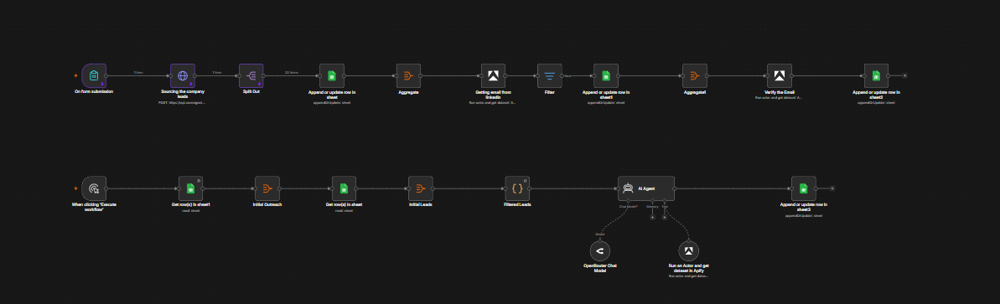

# B2B lead sourcing

Source and verify B2B leads with Apify into Google Sheets.

**Import** [`workflow.json`](workflow.json). 21 nodes, one file.

## Who it is for

Sales and lead-generation teams who want a repeatable pipeline from "the kind of company
I want" to a verified contact list with a drafted first email, recorded in Google Sheets.

## How it works

Two passes that share one spreadsheet.

**Sourcing** starts when you submit the search brief. Companies are sourced, split one per
row and saved. The batch goes to an Apify actor that finds contact addresses, rows with no
address are dropped rather than carried forward, and what remains goes to a second actor
that verifies each one. Only verified contacts reach the final tab, so the list you work
from has already had the bounces taken out.

**Outreach** is a separate pass you run when you are ready. It reads the verified leads and
the log of what has already been sent, drops anyone previously contacted, and asks an agent
with an Apify research tool available to it to draft a first email per lead. The drafts are
written back to the sheet for review rather than sent, so a human approves before anything
leaves.

## Setting it up

1. Attach Google Sheets credentials and point each sheet node at your spreadsheet and tab.
2. Attach an Apify credential to the three Apify nodes and set your actor ids.
3. Attach an OpenRouter credential to the model node.
4. Submit the form once with a small search to watch a batch flow through end to end.

## Requirements

An Apify account with actors for company sourcing, contact lookup and address
verification, an OpenRouter API key, and a Google Sheet.

## Changing what it does

The tone and structure of the first email is the prompt on the writing node. To change what
counts as a usable lead, edit the node that drops rows with no address.

## Pinned data

The original pinned samples on the sourcing and split nodes held real scraped profiles:
names, public profile URLs, job titles and employers for twenty people. They are not
included here. Submit the form once with a small search to produce your own.

The remaining pin on the form node is the search brief itself, which is settings rather
than contact data.
