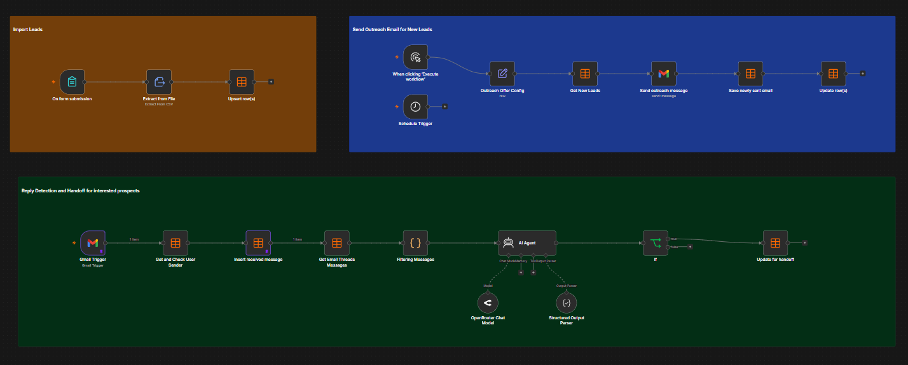

# Cold email and reply triage

Send cold outreach from a lead file and detect replies in Gmail.

**Import** [`workflow.json`](workflow.json). 23 nodes, one file.

## Who it is for

Small sales teams running cold email who want three things joined up: importing a lead
list, sending the first touch, and knowing the moment somebody replies with interest,
without watching an inbox.

## How it works

Three flows around one lead table.

**Import.** Upload a CSV or spreadsheet through the form. The rows are read and upserted
into the lead table, so re-uploading a corrected file updates people rather than
duplicating them.

**Send.** On a schedule or on demand, the offer settings are loaded and the leads not yet
contacted are read. Each gets the outreach email through Gmail, the sent message is
recorded, and the lead row is marked contacted. Marking after the send is what stops a
crash re-mailing anyone.

**Reply detection.** A Gmail trigger fires on an incoming message. It is matched back to a
lead, stored, and the whole thread is pulled so the classifier reads the conversation
rather than one message. Only the prospect's own messages are kept: feeding your own sent
copy back to the model is how a reply classifier convinces itself every thread is
interested. An agent returns a typed classification against a fixed schema, and an
interested prospect is flagged for human handoff.

## Setting it up

1. Attach Gmail credentials to the send node and the trigger, and set the sender address.
2. Fill in the offer config node with your offer, subject line and email body.
3. Create the data tables for leads, sent messages and received messages.
4. Attach an OpenRouter credential to the model node.

## Requirements

A Gmail account, an OpenRouter API key, and n8n data tables for leads and messages.

## Changing what it does

The email copy lives in the offer config node. What counts as interested is the
classifier prompt plus its schema. Change them together.

## Pinned data

The pinned samples on the Gmail trigger and the received-message node are one reply from a
fictional prospect at an `example.com` address. Message and thread ids are placeholders.
